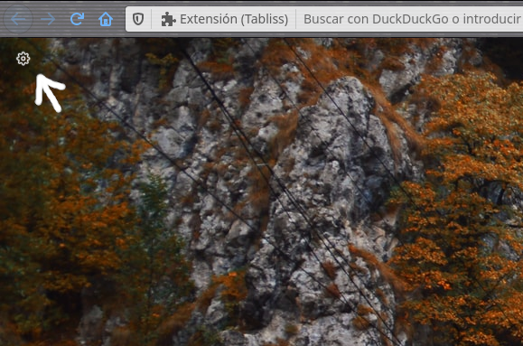
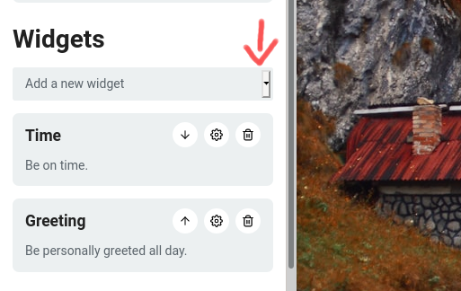
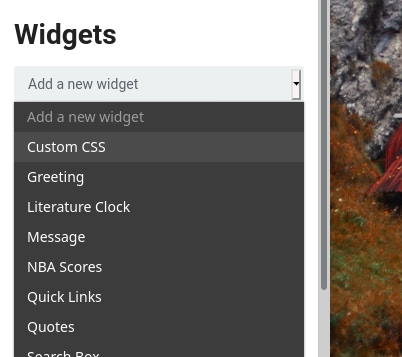
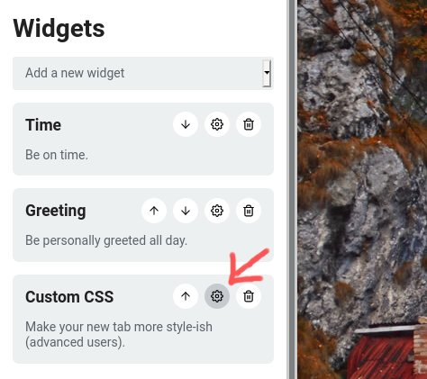
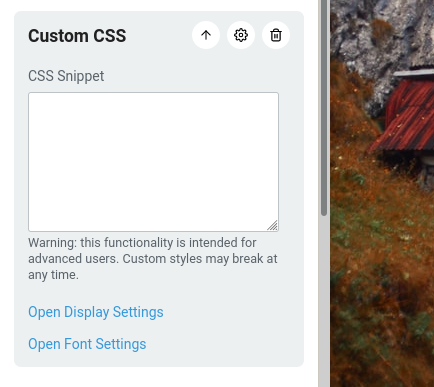

# Transpanight

Tema Oscuro Transparente para la Extension de navegador Tabliss

## Como Agregar Este tema a Tabliss?

Abra una nueva Pestaña, arriba hacia la izquierda de click sobre el engranaje

Dirijase al apartado de "Widgets", y seleccione "Custom CSS"

Ahi mismo en "Widgets", de click sobre el engranaje de "Custom CSS"

Copie el codigo o estilos del "Transpanight.css" a ese cuadro blanco, y... listo.

